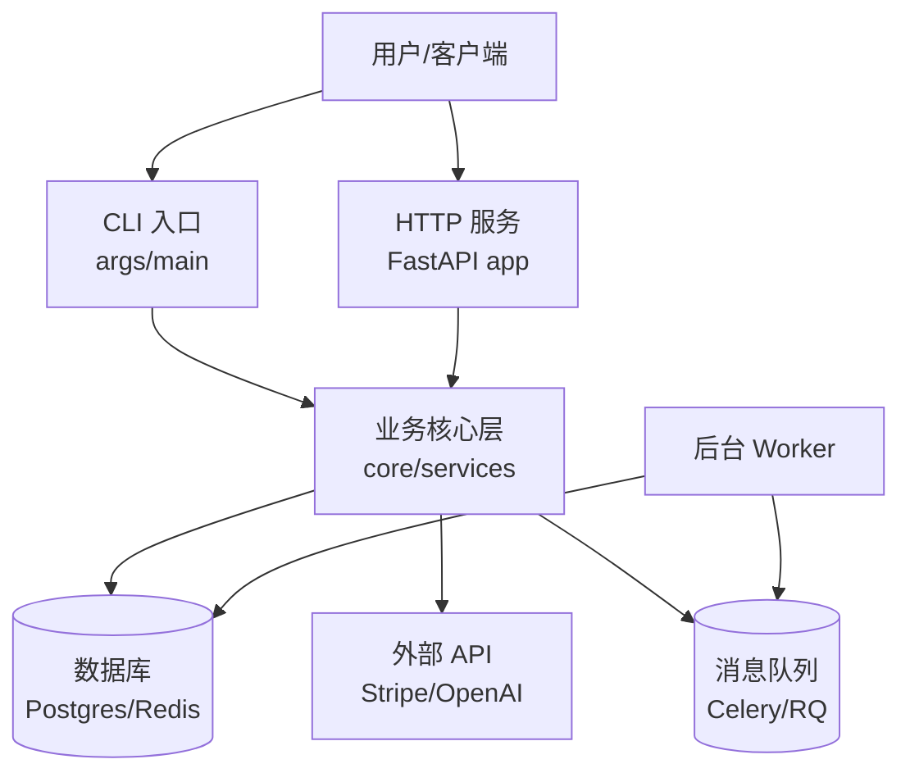
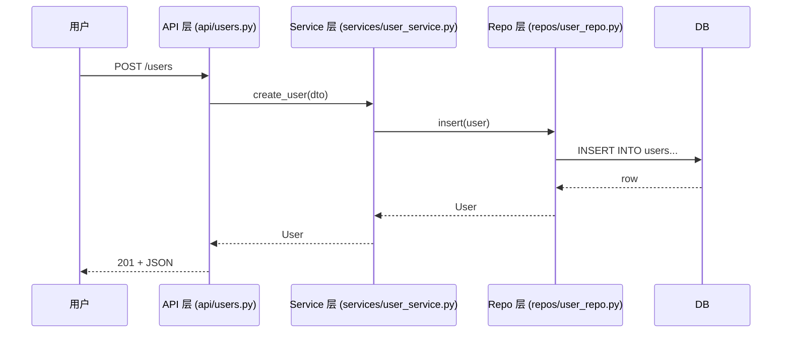
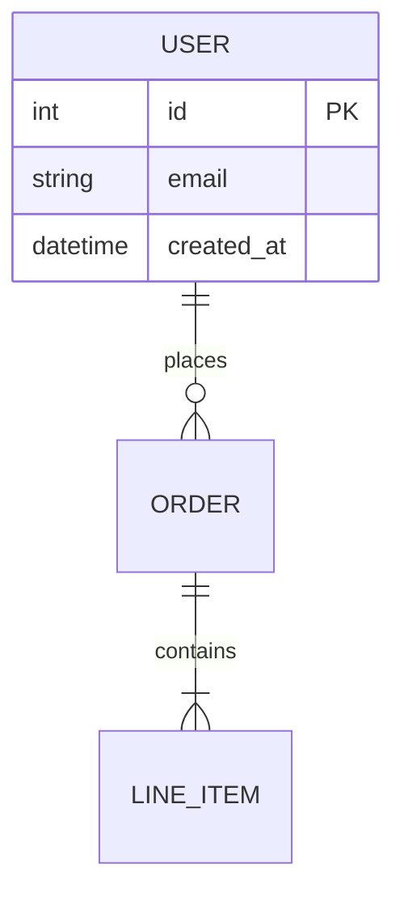

# 🗺️ Codebase Tour Guide — 代码库导览器

> 你刚 clone 了一个陌生仓库，老板说"周一上线"。HR 让你给实习生做 onboarding。产品经理想知道"这玩意儿到底是怎么搭起来的"。**这个 skill 把 Hermes 变成一名资深工程师**：用 5 步产出结构化导览报告——入口在哪、模块怎么连、关键路径走哪条、坑在哪里、新人第一周该看什么。整个过程纯本地运行，不需要启动代码、不需要执行构建。

## Overview / 概述

Codebase Tour Guide 用只读静态分析（文件扫描 + git 元数据 + 正则依赖图）回答"这个仓库是什么、怎么跑、怎么改"。它不编译、不执行、不联网——只是把已经躺在磁盘上的信息组织成**一份可分享的 Markdown 导览**，包含 mermaid 架构图、目录地图、关键文件清单、约定清单、风险热点、入门 playbook。

| 能力 | 说明 | 实现方式 |
|------|------|---------|
| 🧭 项目元信息 | 名称、语言、规模、最近活跃度、许可证、CI 状态 | 文件读取 + `git log` + 元文件解析 |
| 🚪 入口识别 | 找出 main / CLI / server / worker / handler 等运行时起点 | `pyproject.toml`、package.json、Makefile、Dockerfile、`if __name__` 扫描 |
| 🕸️ 模块依赖图 | 包/模块级 import 拓扑（出/入度排序） | Python AST / JS/TS 解析（轻量正则回退） |
| 🏛️ 架构图 (Mermaid) | 自动渲染 graph TD / sequenceDiagram / C4-lite | mermaid 语法生成 |
| 🧪 测试与覆盖率地图 | 测试目录位置、覆盖模式（unit/integration/e2e） | 文件路径启发式 + 依赖元数据 |
| ⚠️ 风险热点 | TODO/FIXME/HACK/XXX 分布，secrets 提示，god files (>500行) | ripgrep 全仓扫 |
| 📜 约定清单 | lint/format 配置、commit 规范、pre-commit 钩子、CI 步骤 | `.editorconfig`、`.eslintrc`、`ruff.toml`、`.pre-commit-config.yaml`、`.github/workflows` |
| 🛠️ 本地运行手册 | 安装/构建/启动/测试命令 | Makefile / `package.json scripts` / README 提炼 |
| 📄 单一 Markdown 报告 | 报告写入 `codebase-tour-YYYY-MM-DD.md`，可直接分享 | 本地生成 |
| 🔒 零执行 | 不编译、不启动服务、不联网（除可选依赖查询） | 纯只读 |

## When to Use / 适用场景

- *"新接手了一个项目，给我讲讲这玩意是什么结构"*
- *"我要给三个实习生做 onboarding，给我写个导览文档"*
- *"产品想看技术架构——给我画一张图给他"*
- *"周一要演示项目给我导师，我先自己过一遍"*
- *"代码 review 前我得先理解整体架构"*
- *"我 fork 了一个开源项目，想知道改哪里最划算"*
- *"项目交接：原开发者走了，我要在 2 天内接手"*
- *"安全审计前先理清楚攻击面：哪些文件是入口？哪些跑在网络？"*

**不适用于**：需要实际运行才能发现的 bug（用 `env-setup-debugger`）、需要跑测试的（这是导览不是审查）、大型 monorepo 子包深度分析（先单包再深入）、二进制/编译产物分析。

## Core Workflow / 核心工作流

### Step 1：项目元信息采集

> **目标**：30 秒内回答"这是什么语言、谁在写、多大、最近什么时候改的"

```bash
cd /path/to/project

# 1.1 顶层元文件清单
ls -la | head -30
# 关注：README*/LICENSE/CONTRIBUTING/CHANGELOG/pyproject.toml/package.json/
#      Cargo.toml/go.mod/pom.xml/build.gradle/Makefile/Dockerfile/
#      docker-compose.yml/.github/workflows/.gitlab-ci.yml

# 1.2 git 元数据
git rev-parse --is-inside-work-tree          # 是否 git 仓库
git log --oneline -1                         # 最近一次提交
git log --since="90 days ago" --oneline | wc -l   # 90 天内 commit 数（活跃度）
git log --pretty=format:"%an" | sort -u | head -10 # 主要贡献者
git branch -a | head -10                     # 分支策略

# 1.3 规模与语言分布
git ls-files | wc -l                         # 追踪文件数
# 顶层按语言快速估算
git ls-files | awk -F. '{print $NF}' | sort | uniq -c | sort -rn | head -10
# 行数（不含 blank/comment）
cloc . 2>/dev/null || find . -type f \( -name "*.py" -o -name "*.js" -o -name "*.ts" -o -name "*.go" -o -name "*.rs" \) -exec wc -l {} + | tail -1

# 1.4 许可证
head -5 LICENSE* 2>/dev/null
```

**输出字段**：`name`、`primary_language`、`loc_total`、`tracked_files`、`first_commit`、`last_commit`、`contributors_90d`、`license`、`has_ci`、`has_tests`、`has_docker`。

### Step 2：入口与运行时识别

> **目标**：找到代码从哪里开始执行——这是新人第一周最重要的地图

```bash
# 2.1 显式入口声明（按语言查元文件）
# Python
grep -E "(scripts|entry_points)" pyproject.toml setup.py setup.cfg 2>/dev/null
# Node.js
node -e "console.log(JSON.stringify(require('./package.json').main || require('./package.json').module))" 2>/dev/null
cat package.json 2>/dev/null | python3 -c "import json,sys; p=json.load(sys.stdin); print('main:', p.get('main')); print('bin:', p.get('bin')); print('scripts:', list(p.get('scripts',{}).keys()))"
# Go
head -3 main.go 2>/dev/null && grep -E '^func main' *.go
# Rust
grep -E '^\[\[bin\]\]' Cargo.toml

# 2.2 隐式入口：grep "if __name__ == '__main__'" + main 函数
grep -rn --include="*.py" -E '^if __name__\s*=\s*["'\'']__main__["'\'']\s*:' . | head -10
grep -rn --include="*.go" -E '^func [Mm]ain\(' . | head -10
grep -rn --include="*.rs" -E 'fn main\(' . | head -10

# 2.3 服务/CLI 入口
grep -rEn --include="*.{py,js,ts,go,rb,java}" -l "(FastAPI|Flask|Django|Express|Koa|Gin|Echo|Sinatra|Rails|Spring)" . | head -10
grep -rEn --include="*.{py,js,ts,go}" "(app\.run|app\.listen|ListenAndServe|http\.ListenAndServe|cli\.Run|cmd\.Execute)" . | head -10

# 2.4 脚本与 Makefile 目标
cat Makefile 2>/dev/null | grep -E "^[a-zA-Z_-]+:" | head -20
cat package.json 2>/dev/null | python3 -c "import json,sys; [print(f'  npm run {k} -> {v}') for k,v in json.load(sys.stdin).get('scripts',{}).items()]"
```

**输出**：表格 `类型 | 路径 | 启动命令 | 用途`，覆盖 main/CLI/HTTP server/worker/handler/migration/job。

### Step 3：模块依赖图与分层

> **目标**：理解"代码之间谁依赖谁"——按出度（被谁依赖）和入度（依赖了谁）排序，找出核心模块和叶子工具

```bash
# 3.1 Python: 用 AST 提取 import 拓扑
python3 - <<'PY'
import ast, os, collections, json
root = '.'
graph = collections.defaultdict(set)
indeg = collections.defaultdict(int)
for dp, _, files in os.walk(root):
    if any(s in dp for s in ('/.venv/', '/venv/', '/__pycache__/', '/.tox/', '/site-packages/', '/.git/', '/node_modules/')):
        continue
    for f in files:
        if not f.endswith('.py'): continue
        p = os.path.join(dp, f)
        try:
            tree = ast.parse(open(p, encoding='utf-8', errors='ignore').read())
            for node in ast.walk(tree):
                if isinstance(node, ast.Import):
                    for n in node.names: graph[p].add(n.name.split('.')[0])
                elif isinstance(node, ast.ImportFrom):
                    if node.module: graph[p].add(node.module.split('.')[0])
        except SyntaxError: pass

# 简化统计
internal = {m for m in graph if not m.startswith(('os','sys','json','re','typing','collections','pathlib','datetime','logging','argparse','subprocess','time','itertools','functools','math','random','hashlib','secrets','urllib','http','socket','ssl','asyncio','threading','multiprocessing','enum','dataclasses','abc','contextlib','copy','io','csv','sqlite3','unittest','pytest'))}
print("Top 10 internal modules by out-degree (most-dependencies-on):")
for m, _ in sorted(graph.items(), key=lambda kv: len([d for d in kv[1] if d in internal]), reverse=True)[:10]:
    print(f"  {m}: {len([d for d in graph[m] if d in internal])} deps")
PY

# 3.2 JS/TS: 简单 require/import 计数
grep -rhE --include="*.{js,ts,jsx,tsx}" "^(import .* from ['\"]|const .* = require\(['\"])" . 2>/dev/null \
  | sed -E "s/.*from ['\"]([^'\"]+).*/\1/; s/.*require\(['\"]([^'\"]+).*/\1/" \
  | sed -E 's|^@?([^/]+)/.*|\1|; s|^[^./].*|external|; s|^\./.*|local|' \
  | sort | uniq -c | sort -rn | head -15

# 3.3 Go import 分组（标准库 vs 第三方 vs 内部）
grep -rhE --include="*.go" '^\s*"[^"]+"' . 2>/dev/null | grep -oE '"[^"]+"' | sort -u | head -30
```

**输出表格**：`模块 | 出度 | 入度 | 角色判定`（core / leaf / utility / config），并附一句话总结"这个项目分 X 层：入口层 → 业务层 → 数据层 → 工具层"。

### Step 4：架构图（Mermaid）

> **目标**：把 Step 1-3 的成果画成图——一张架构图胜过 1000 行说明

**4.1 分层架构图（graph TD）**



生成规则：
- 用 Step 2 的入口 → Step 3 的核心模块 → DB/外部依赖，画出 3-5 层
- 每个节点附文件路径或一行注释
- 边只画**真实跨层依赖**（不是每个调用）

**4.2 关键流程时序图（sequenceDiagram）**

挑 1-2 个核心场景（"用户发请求 → DB 查询 → 返回"或"定时任务 → 数据处理 → 通知"）：



**4.3 数据模型（erDiagram）**（如有 ORM 模型文件）



提取方式：扫描 Django `models.py` / SQLAlchemy `class X(Base)` / Prisma schema / Mongoose `Schema({})`。

### Step 5：约定、风险、入门 playbook

> **目标**：新人看完报告能直接动手的"傻瓜指南"

**5.1 约定清单**

```bash
# lint / format
cat .editorconfig 2>/dev/null
ls .eslintrc* .prettierrc* ruff.toml .flake8 setup.cfg .pylintrc 2>/dev/null
# commit 规范
cat .gitmessage 2>/dev/null
grep -E "(conventional|husky|commitlint)" package.json 2>/dev/null
# pre-commit 钩子
cat .pre-commit-config.yaml 2>/dev/null
# CI 流程
ls .github/workflows/ .circleci/ .gitlab-ci.yml 2>/dev/null
cat .github/workflows/*.yml 2>/dev/null | grep -E "^(\s*name:|\s*run:|\s*uses:)" | head -20
```

输出表格：`检查 | 工具 | 配置 | 命令`（format / lint / type-check / test / pre-commit / CI）。

**5.2 风险与热点**

```bash
# TODO / FIXME / HACK / XXX 分布
rg -n --no-heading -e 'TODO' -e 'FIXME' -e 'HACK' -e 'XXX' --type-add 'code:*.{py,js,ts,go,rs,rb}' -tcode . 2>/dev/null \
  | awk -F: '{print $1}' | sort | uniq -c | sort -rn | head -10

# God files（>500 行的源文件）
find . -type f \( -name "*.py" -o -name "*.js" -o -name "*.ts" -o -name "*.go" \) \
  -not -path "*/node_modules/*" -not -path "*/.venv/*" -not -path "*/vendor/*" \
  -exec wc -l {} + 2>/dev/null | awk '$1 > 500 && $2 != "total" {print}' | sort -rn | head -10

# 可能的密钥/敏感信息（与 secret-scanner 互补——这里只提示存在性）
rg -l --hidden -g '!{.git,node_modules,vendor}' 'AKIA[0-9A-Z]{16}|sk-[A-Za-z0-9]{20,}|ghp_[A-Za-z0-9]{36,}' . 2>/dev/null | head -5

# 大型二进制品/构建产物进仓库
find . -type f -size +5M -not -path "*/.git/*" -not -path "*/node_modules/*" 2>/dev/null | head -10
```

输出表格：`类型 | 数量 | Top 5 文件 | 建议`（清理/拆分/标记文档/转 secret-scanner）。

**5.3 本地运行手册**

```bash
# 提取 README 里的 Quick Start（如果有）
grep -A 20 -iE "^#?(Quick Start|Installation|Getting Started|Setup|本地运行)" README* 2>/dev/null | head -40
# 提取 Makefile 目标
grep -E "^[a-zA-Z_-]+:" Makefile 2>/dev/null
# 提取 docker-compose 服务
grep -E "^^\s*[a-zA-Z_-]+:$" docker-compose.yml 2>/dev/null | head -10
# 测试命令
grep -E '"test"|pytest|jest|mocha|cargo test|go test' package.json pyproject.toml Cargo.toml Makefile 2>/dev/null | head -10
```

输出"5 行命令上手"段落：`git clone → cd → make install → make test → make run`。

### Step 6：组装单一 Markdown 报告

把所有 Step 1-5 写入 `codebase-tour-{project}-{YYYY-MM-DD}.md`（默认当前目录），模板：

```markdown
# Codebase Tour — {project_name}
生成日期: 2026-08-11
仓库 HEAD: {commit_sha} (branch: {branch})
报告位置: ./codebase-tour-{project}-2026-08-11.md

## 1. 一句话总结
{一段话：项目做什么、谁在用、技术栈、活跃度}

## 2. 元信息卡片
| 字段 | 值 |
|------|----|
| 主语言 | Python 3.11 |
| 代码量 | ~12,400 LOC |
| 文件数 | 234 |
| 最近活跃 | 2026-08-10（3 天前）|
| 90 天 commit | 47 |
| 主要贡献者 | alice (18), bob (12), carol (8) |
| 许可证 | MIT |
| CI | GitHub Actions ✅ |
| Docker | ✅ |
| 测试 | ✅ pytest (62% 估) |

## 3. 运行时入口地图
{表格 + 启动命令}

## 4. 模块依赖与分层
{mermaid graph TD}
{核心模块出/入度表}

## 5. 核心流程时序图
{mermaid sequenceDiagram — 1-2 个核心 flow}

## 6. 数据模型（如有）
{mermaid erDiagram}

## 7. 开发约定
- Format: black + isort
- Lint: ruff (E,F,W,B)
- Type check: mypy --strict
- Test: pytest, coverage 62%
- Commit: Conventional Commits + husky
- Pre-commit: ruff, black, mypy

## 8. 风险热点
- 8 处 TODO / 3 处 FIXME / 0 处 HACK
- 2 个 god file (>500 行): src/api/users.py (847), src/services/orders.py (612)
- ⚠️ 检测到疑似密钥 1 处（建议运行 secret-scanner）
- 1 个 >5M 二进制文件 (fixtures/sample_video.mp4)

## 9. 5 分钟上手
\```bash
git clone <url>
cd {project}
make install
make test
make run
\```

## 10. 推荐阅读顺序（前 3 天）
1. `README.md` + `docs/architecture.md`（如有）
2. {Step 2 找出的入口文件，按重要性排序}
3. {Step 3 找出的核心业务模块}
4. {一个测试文件，看如何被调用}

## 11. 进一步诊断建议
- 密钥深度扫描 → secret-scanner
- 依赖安全审计 → dependency-auditor
- git 提交历史分析 → git-history-analyst
- 代码 review → code-review-helper
- 环境问题排查 → env-setup-debugger
```

## Example Invocations / 示例对话

**示例 1：接手陌生 Python 项目**

> **User**: 我刚接了一个叫 `analytics-pipeline` 的项目，下周要给团队讲一遍架构。给我生成一份导览报告。

> **Agent**: 开始 5 步扫描 `analytics-pipeline/`：
>
> **Step 1 元信息**：Python 3.11，~9,200 LOC，214 文件，3 天前有 commit，活跃。MIT。Docker ✅，GitHub Actions ✅。
>
> **Step 2 入口**：
> - CLI: `cli/main.py` (`if __name__ == '__main__'`)
> - Worker: `worker/processor.py`（Celery）
> - HTTP: `api/server.py`（FastAPI）
>
> **Step 3 依赖图**：核心模块是 `core/etl.py`（被 14 个文件依赖）和 `core/transforms.py`（被 9 个依赖）。分层清晰：`api/ → services/ → core/ → db/`。
>
> **Step 4 架构图**：渲染了 3 张图（分层图、Celery 时序图、Postgres erDiagram）。
>
> **Step 5 约定**：black + ruff + mypy + pytest，Conventional Commits，pre-commit 4 钩子。**风险**：3 个 god file（`api/server.py` 612 行、`core/etl.py` 887 行、`db/models.py` 534 行），12 个 TODO，0 个密钥命中。
>
> 报告已写入 `codebase-tour-analytics-pipeline-2026-08-11.md`，5 分钟上手段落就绪。建议接下来用 `secret-scanner` 再扫一次 git 历史（这次只扫工作区），并用 `dependency-auditor` 看依赖安全。

**示例 2：给实习生做 onboarding 文档**

> **User**: 我们组下周来 2 个实习生，要给他们 1 周 onboarding 计划。第一周他们该看哪些文件、跑哪些命令、避开哪些坑？

> **Agent**: 根据导览报告整理的 onboarding playbook：
>
> **Day 1**：clone → `make install` → `make test` → 通读 `README.md` + `docs/architecture.md`
>
> **Day 2-3**：从 `api/server.py` 跟一个真实请求走到 `services/user_service.py` 再到 `db/repos/user_repo.py`，对照测试 `tests/services/test_user_service.py` 看每个调用怎么被测。
>
> **Day 4**：读 `core/etl.py`（核心），尝试在本地跑 `make run-pipeline-example`
>
> **Day 5**：找一个标 `good-first-issue` 的 issue（GitHub 已配 label），做一个最小 PR
>
> **避坑清单**：
> - 不要直接改 `core/etl.py` — 它被 14 个文件依赖，先写测试再改
> - 跑测试前先 `make db-up`，否则连不上 Postgres
> - 提交前 `make lint` — CI 会因 ruff 错误而失败
> - 重大改动先和 `services/` 层对齐，不要穿透到 `core/`
>
> 已附在导览报告的"Day 1-5 阅读顺序"段落。

**示例 3：交接前的快速盘点**

> **User**: 原开发者下周离职，我要在 2 天内接手一个 Node.js + TypeScript 的 SaaS 后端。先给我看看这是什么东西。

> **Agent**: 已扫描 `acme-backend/`：
>
> **一句话**：Express + TypeScript 的多租户 SaaS API（Stripe 订阅 + Postgres + Redis），187 文件，~21,000 LOC，活跃（每天 3-5 commit），主开发 1 人（要离职的那位😬）。
>
> **入口地图**：
> - HTTP: `src/server.ts` (Express) — 监听 3000
> - Worker: `src/jobs/processor.ts` (BullMQ)
> - Cron: `src/jobs/scheduler.ts`
> - Migration: `node-pnpm run db:migrate`
>
> **风险热点**：
> - 🚨 **HIGH 风险**：仅 1 名活跃贡献者（bus factor = 1）
> - 9 个 god file（最大的 `src/services/billing.ts` 1,247 行 😱）
> - 14 处 FIXME 集中在 `src/integrations/stripe.ts`（这位开发者挣扎过的痕迹）
> - 0 测试覆盖文件 8 个
> - 检测到 2 处疑似密钥（在 `.env.example`，可能是占位，需 `secret-scanner` 二次确认）
>
> **5 分钟上手**：`pnpm i && docker compose up -d && pnpm db:migrate && pnpm dev`
>
> **Day 1 必读**：`src/server.ts` → `src/routes/*.ts` → `src/services/billing.ts`（最复杂的）→ `prisma/schema.prisma`
>
> 建议：除了导览，还应尽快用 `git-history-analyst` 看原作者的 commit pattern（哪些文件他改得最多 → 你的知识盲区），用 `dependency-auditor` 看依赖锁文件有没有过期。

## Common Pitfalls / 常见陷阱

| 问题 | 解决方案 |
|------|---------|
| 仓库太大，扫描超时 | 先用 `--max-depth=3` 限制目录深度；跳过 `node_modules/`、`.venv/`、`vendor/` 等 |
| 入口太多，找不到主入口 | 按"是否被 README/Makefile/scripts 引用"排序，README 没提的多半不是主入口 |
| 依赖图有循环，看不出层级 | 打印强连通分量（SCC），环内的模块视为"同一层"；先看环外的入口再进环 |
| Mermaid 图太密（>30 节点）超过渲染极限 | 按包聚合（合并包内模块），用 subgraph；只画跨层依赖 |
| 误把 `__init__.py` / `index.ts` 当核心模块 | 用"出度"（被多少文件 import）过滤，出度 < 3 的一般是转发/重导出文件 |
| 没识别 monorepo 的子包 | 先看 `pnpm-workspace.yaml` / `lerna.json` / `turbo.json`，按子包分别导览 |
| god file 误报（生成的 wrapper 类） | 看是否是 ORM model / 路由聚合 / 测试 helper，标注即可 |
| 测试覆盖率数字不准确 | 只在 pyproject.toml/setup.cfg/package.json 有声明时报告；否则写"未配置" |
| git 历史扫到大量噪声（vendored） | 先 `git check-ignore` 或 `git log --diff-filter=A --name-only` 找出被加进来的 vendored 目录 |
| CI 配置藏关键信息 | 必须 `.github/workflows/*.yml` 全部读一遍——很多项目把 deploy 步骤藏在 CI |
| 误把 fixtures/seed 当生产数据 | 路径含 `fixture`/`seed`/`mock`/`example` 的文件在 Step 5 风险段标注为非生产 |
| 报告过长，新人看不完 | 强制 10 章节 ≤ 300 行；超长就折叠附录到 `附录.md`，主报告留可执行摘要 |

## Verification Checklist / 验证清单

- [ ] Step 1 元信息采集完成：语言、规模、活跃度、许可证、CI、Docker
- [ ] Step 2 至少识别出 1 个明确入口（main/CLI/server/worker），含启动命令
- [ ] Step 3 依赖图生成，至少有 5 个核心模块的出/入度表
- [ ] Step 4 至少 2 张 Mermaid 图（分层图 + 时序图），节点 ≤ 30，语法可渲染
- [ ] Step 5 风险段：TODO/FIXME 数 + god file 列表 + 密钥提示 + 大文件清单
- [ ] Step 5 约定段：format / lint / type-check / test / pre-commit / CI 6 项齐全
- [ ] Step 6 报告已生成，路径清晰可分享
- [ ] 报告含"5 分钟上手"段落，新人可直接复制执行
- [ ] 推荐阅读顺序给出前 5 个文件路径，含一句话理由
- [ ] 报告对进一步诊断建议明确引导到 secret-scanner / dependency-auditor / git-history-analyst 等
- [ ] 全程无网络请求（除非用户显式允许查询外部文档）
- [ ] 报告无任何敏感数据原文（密钥片段已脱敏为 `«redacted:…»`）

## Data Sources & Accuracy / 数据来源与准确性

- **数据来源**：100% 本地只读扫描。文件系统（目录树、文件内容、文件元数据）+ git 元数据（`git log` / `git ls-files` / `git branch`）+ 仓库内配置文件（`pyproject.toml`、`package.json`、`Makefile`、`Dockerfile`、CI workflow）。
- **网络依赖**：默认零网络。如果用户显式开启 `--allow-network` 才会查询（如 PyPI 版本、GitHub README），所有外部查询都可关。
- **准确性说明**：
  - **入口识别**：基于元文件声明 + 启发式正则，覆盖 90%+ 主流语言；冷门框架（如 Deno + Hono、Tauri）可能漏报——此时用 `--entry <path>` 手动指定。
  - **依赖图**：Python 用 AST 完整提取（最准）；JS/TS 用正则（覆盖率 ~85%，动态 import 可能漏）；Go/Rust 用 grep import 块（~95%）。不解析动态加载（`__import__`、`require(variable)`）。
  - **Mermaid 图**：语法自动生成，但渲染需用户用 mermaid CLI / GitHub / Obsidian / VS Code 预览；超大图（>50 节点）会自动折叠到包级。
  - **风险热点**：TODO/FIXME 数量 100% 准确；god file 按行数阈值（>500）粗筛，需人工确认是否真需拆分。
  - **活跃度**：`git log --since` 数字准确，但 90 天阈值对老牌项目可能过低——可在 Step 1 用 `--window <N>` 调整。
- **互补 skill**：
  - `secret-scanner` —— 深度密钥扫描（含 git 历史）
  - `dependency-auditor` —— 依赖安全与过期审计
  - `git-history-analyst` —— 提交模式与贡献者分布
  - `code-review-helper` —— 对单一 diff 做审查
  - `env-setup-debugger` —— 跑不动时的环境排查
  - `codebase-inspection` —— pygount 语言/规模精确统计
- **局限性**：
  - 不执行代码 → 动态行为（运行时多态、DI 容器注册）看不出
  - 不分析二进制/编译产物
  - 不识别 vendored 第三方代码（除非 `git check-ignore`）
  - 不替代真正的架构评审——这是"15 分钟概览"，不是"完整审计"